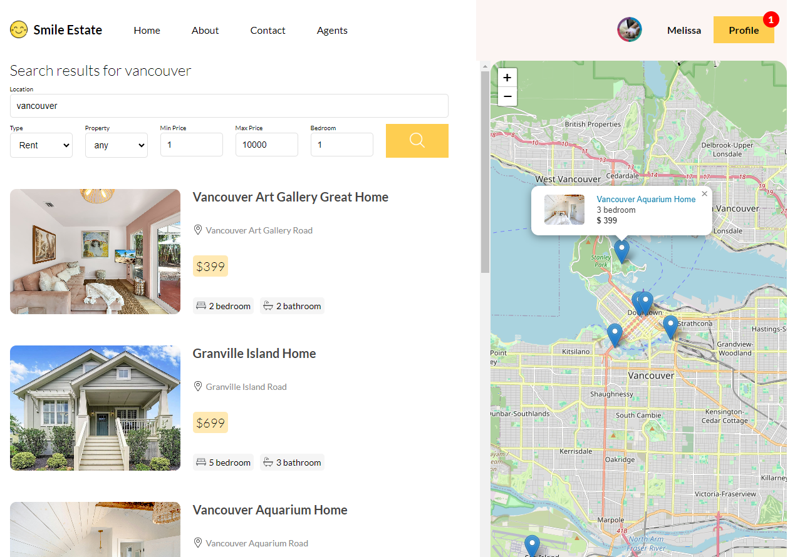
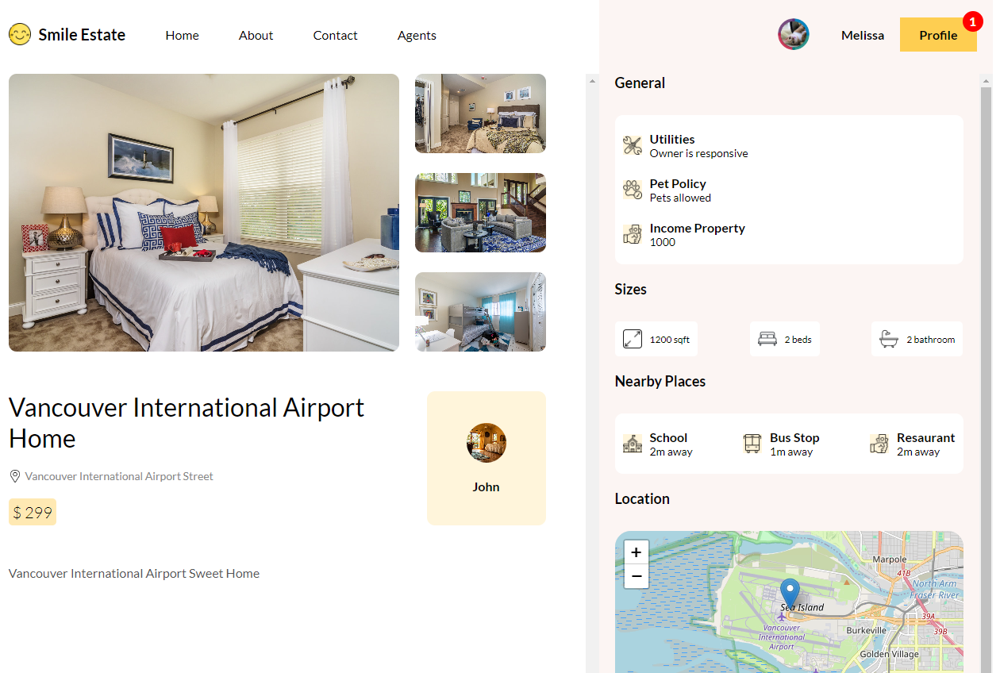
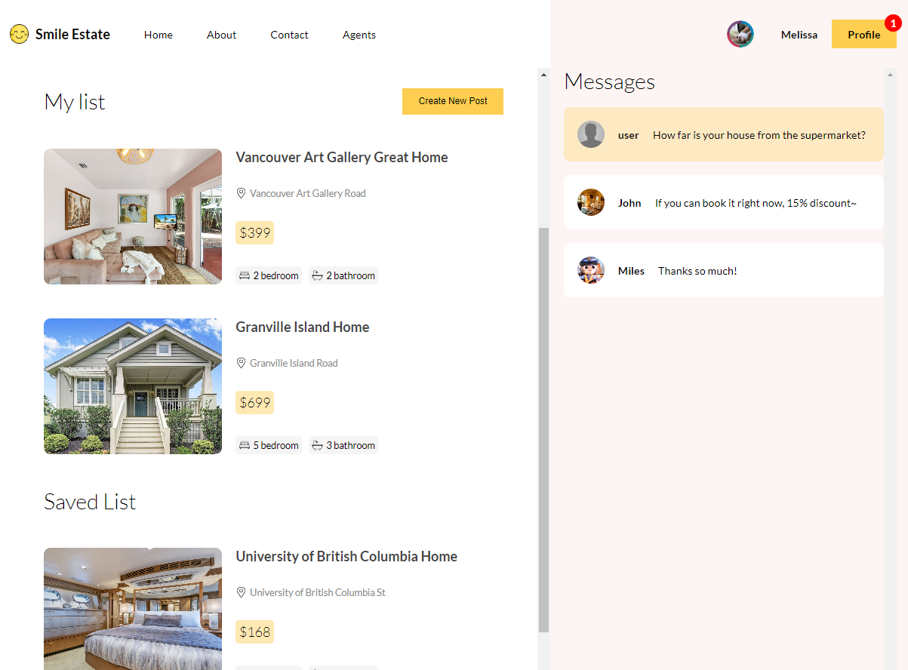
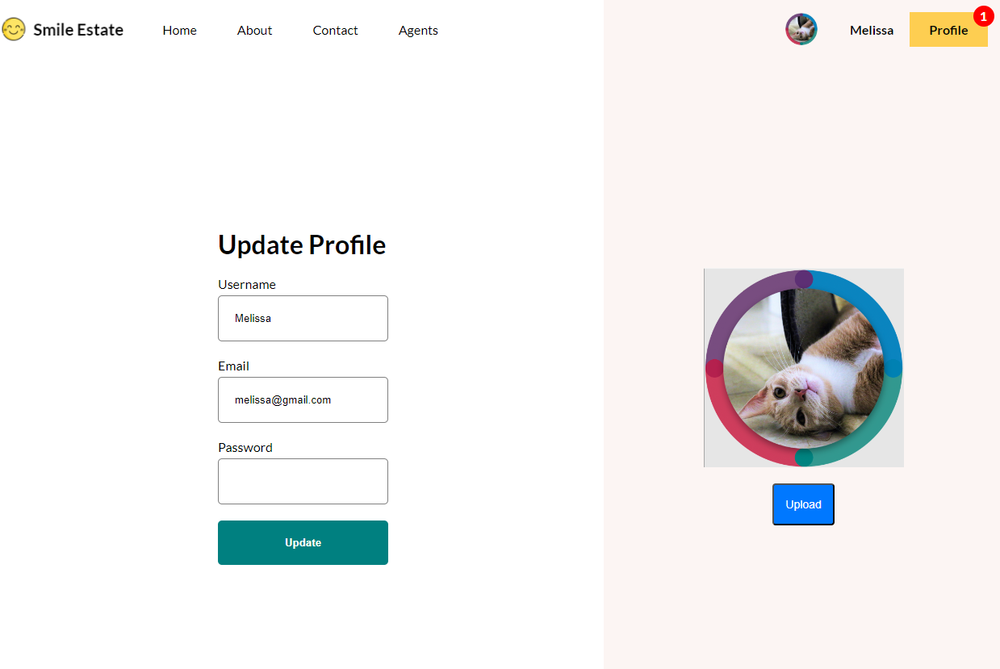

# SmileEstate 

SmileEstate is a platform designed to help people find and post properties for sale or rent, with a real-time chat feature to enhance communication efficiency between both parties.


## Tech Stack

**Client:** React, Vite, Context API, React Router Dom, SCSS, HTML<br>
**Server:** Node.js, Express, MongoDB, Prisma, Socket, JWT, Cookies


## Features

- Core Feature 1 - Search for rental or saled properties<br>
   <br><br><br>

- Core Feature 2 - Look over property details<br>
   <br><br><br>

- Core Feature 3 - Save your favorite property<br>
   <br><br><br>

- Core Feature 4 - Communication efficiency using realtime chats<br><br>
   <br><br><br>

- Core Feature 5 - Customize your personal profile<br>
   

## Demo

https://smile-estate-app.onrender.com


## Installation

Install my-project with npm

```bash
  cd estate_app
  npm install

  cd api
  npm install

  cd client
  npm install

  cd socket
  npm install
```
    
## Environment Variables

To run this project, you will need to add the following environment variables to your .env file.

`DATABASE_URL`: The MongoDB connection string.

`JWT_SECRET_KEY`: The secret key for JWT (JSON Web Token) authentication.

`CLIENT_URL`: The URL of your front-end application.


## References

[Lama Dev](https://www.youtube.com/watch?v=eJ3YysWaP_A) | [Vite](https://vitejs.dev/) | [React Image SDK](https://cloudinary.com/documentation/react_image_and_video_upload) | [Socket.io](https://socket.io/docs/v4/tutorial/introduction) | [Leaflet](https://leafletjs.com/) | [Prisma](https://www.prisma.io/) | [OpenAI](https://openai.com/)

## Credits
- Images and Logo from Google Images
## Authors

- [@Melissa-Shao](https://github.com/Melissa-Shao)